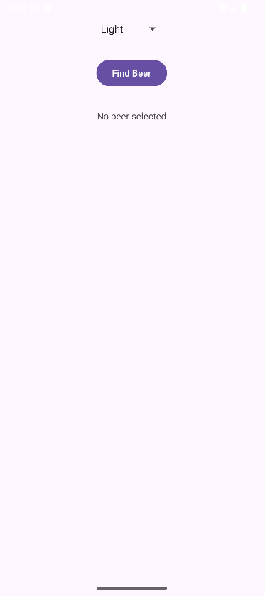
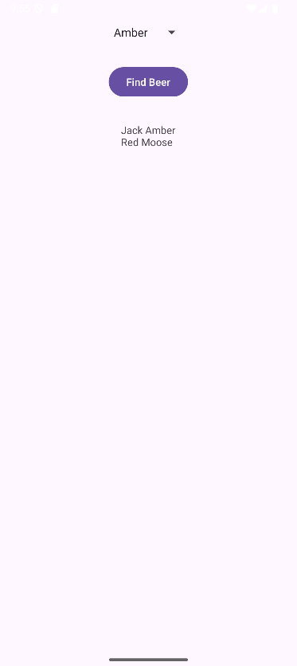

# Beer-Adviser
Учебное приложение-советчик по пиву, созданное при изучении книги "Head First Android Development".

# Описание
Пользователь выбирает цвет пива из выпадающего списка (Spinner), нажимает кнопку "Find Beer!" и получает список подходящих сортов.

# Стек технологий
- Язык: Kotlin
- UI: XML Layout (LinearLayout)
- Компоненты: Spinner, Button, TextView
- Ресурсы: Strings.xml, массив строк для выпадающего списка
- Логика: Обработка клика кнопки (setOnClickListener)

# Ключевые навыки, демонстрируемые в проекте:
- Создание активности и макета
- Работа с базовыми View-компонентами (Spinner, Button, TextView)
- Извлечение строковых ресурсов
- Реализация простой бизнес-логики в активности

# Скриншоты

  
  

